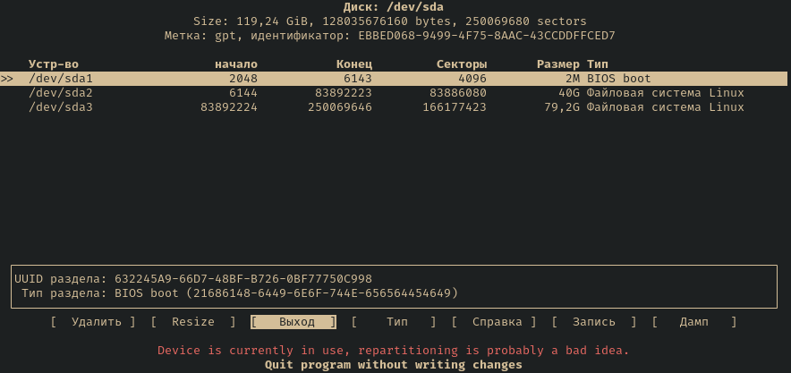
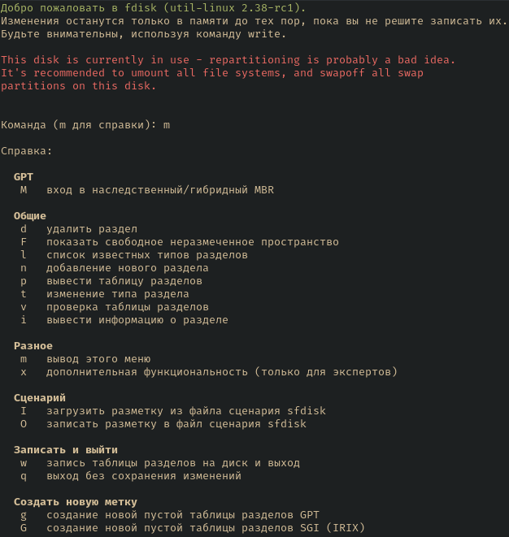
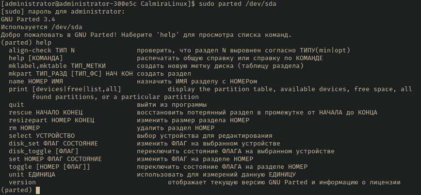

# Подготовка дисков

## Блочные устройства

Ядро Linux по-другому называет блочные устройства, разделы и файловые системы, в
отличие от Windows, систем BSD и прочих.

Устройства SCSI и Serial ATA обозначаются как `/dev/sda`, `/dev/sdb`, `/dev/sdc`
и так далее. В случае использования NVMe: `/dev/nvme0n1`, `/dev/nvme0n2` и т.д.

| Тип | Название | Описание |
|-----|----------|----------|
| SATA, SCSI, USB Flash | `/dev/sda` | Наиболее используемый тип |
| NVMe | `/dev/nvme0m1` | На данный момент передовая технология твердотельных накопителей. Первый раздел на таких накопителях называется `/dev/nvme0n1p1` |
| MMC, eMMC, SD | `/dev/mmcblk0` | SD-карты и прочие карты памяти. **Не рекомендуется** для установки системы или хранения важных файлов вроде бекапов |

## Таблица разделов

### GPT

GPT использует 64 битные идентификаторы разделов. Предельный размер раздела
около 8 ЗиБ.

При использовании UEFI, GPT является почти обязательным для использования, так
как при использовании MBR могут случаться всевозможные ошибки.

### MBR (DOS)

Впервые появился в PC DOS 2.x (1983). Использует 32 битные идентификаторы для
определения начала сектора и длины раздела, а также поддерживает 3 типа
разделов: основной, расширенный и логический.

Ограничение размера раздела в 2 Тб, без использования расширенных разделов
поддерживается максимум 4 раздела, а также, в отличие от GPT, отсутствуют
средства для резервирования главное загрузочной записи, поэтому если что-то
затрёт таблицу разделов, то вся информация будет потеряна.

## Рекомендуемая схема разделов

Разработчики Calmira GNU/Linux-libre рекомендуют использовать таблицу разделов
GPT при любой возможности. Схема разделов представлена ниже:

### BIOS

| Раздел | ФС | Размер | Описание |
|--------|----|--------|----------|
| `/dev/sda1` | BIOS Boot (в некоторых инструментах отсутствует, тогда выбирайте "Без ФС" | 1 Мб | При использовании GPT таблицы разделов в компьютере с BIOS, данный раздел требуется для загрузки с этого накопителя. Если вы используете MBR, а не GPT, то и необходимость в таком разделе отпадает |
| `/dev/sda2` | swap | Половина объёма ОЗУ в базовых задачах, рекомендуется объём ОЗУ * 2 | Подкачка (swap) |
| `/dev/sda3` | ext4 | Оставшийся объём | Корневой раздел |

### UEFI

| Раздел | ФС | Размер | Описание |
|--------|----|--------|----------|
| `/dev/sda1` | Fat32 | 256 Мб | Раздел EFI |
| `/dev/sda2` | swap | Половина объёма ОЗУ (для выполнения обычных задач), рекомендуется объём ОЗУ * 2 | Подкачка (swap) |
| `/dev/sda3` | ext4 | Оставшийся объём | Корневой раздел |

### Создание разделов

Для создания разделов используются программы `fdisk` и `cfdisk`. Настоятельно
рекомендуем использовать эти утилиты для разметки диска, куда будет установлен
дистрибутив. Кроме них есть `parted`, но это более сложная утилита для
продвинутого пользователя. Программа по умолчанию не установлена в Calmira, но
есть порт `postcpl/parted`. Используйте его для установки этой программы.

> Утилита `cfdisk`

> Утилита `fdisk`

> Утилита `parted`
