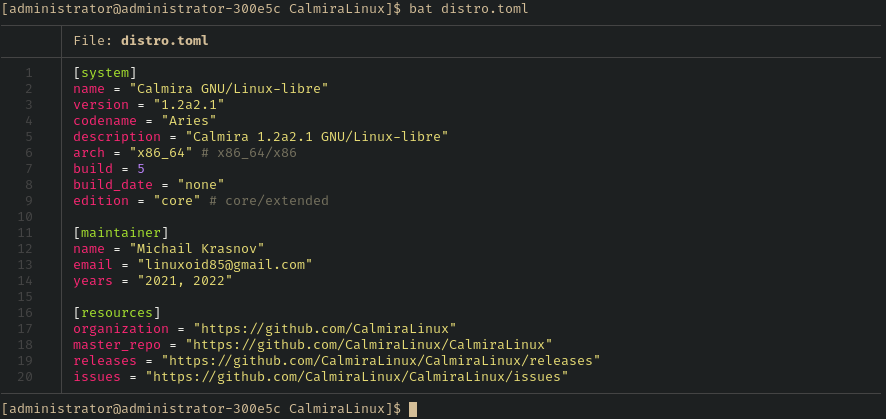

# Сборка Calmira GNU/Linux-libre из исходного кода



## Выбор редакции

Для начала требуется выбрать нужную редакцию, которую вы собираетесь
устанавливать себе на компьютер. Как было написано ранее, существует две
редакции Calmira: Core и Extended. Первая редакция представляет из себя
минимальную систему, некий конструктор, из которого пользователь собирает в
дальнейшем необходимую ему систему. Данную редакцию можно сравнить с Arch
GNU/Linux, который также представлен минимальной системой. Различие в том, что
Arch имеет пакетный менеджер, да и в целом он проще.

Extended - это расширенная редакция дистрибутива, содержащая дополнительный
софт, такой как X сервер, рабочее окружение Ascetico и прочее ПО, необходимое
для комфортной работы пользователя. Данная редакция собирается на основе Core,
да и, по сути, ей же и является.

Если вам важна легковесность системы и максимальный контроль над ней, то
выбирайте редакцию Core. Если вам нужно быстро начать работу, то используйте
Extended редакцию. Но не стоит думать о том, что расширенная версия проще
минимальной. По сложности или простоте они одинаковы. Различие в наборе
предустановленного программного обеспечения и некоторых настройках.

## О времени сборки

Так как обе редакции содержат довольно большое число ПО, которое предназначено
как для работы операционной системы, так и для выполнения других целей, обе
редакции собираются довольно долгое время. Конечно, при ручной сборке время
будет ещё б*о*льшим, а автоматизация несколько сокращает его, однако обе
редакции включают в себя некоторые довольно большие пакеты, которые собираются
долгое время сами по себе.

Время сборки зависит от настроек хост-системы, железа компьютера, на котором
производится сборка, а также от версии необходимых для построения пакетов
(например, `gcc`).

В среднем, Core редакция собирается от трёх часов до одного-полутора дней.
Расширенная редакция: от пяти часов до двух дней.

Для ускорения сборки вы можете воспользоваться многопоточностью. Для этого
выполните:

```bash
export MAKEFLAGS='-jX'
export NINJAJOBS=X
```

Замените `X` на число потоков процессора, которые необходимо задействовать для
сборки системы. Например, у меня 4 потока, тогда команды будут такими:

```bash
export MAKEFLAGS='-j4'
export NINJAJOBS=4
```

По умолчанию система сборки `ninja` запускает максимальное число процессов
параллельно. По умолчанию это количество ядер в системе + 2. В некоторых случаях
это может привести к перегреву ЦП и/или нехватке памяти. Поэтому вторая команда
(`export NINJAJOBS ...`) предназначена и для защиты вашего ПК от этих проблем.

!!! warning "Внимание"
    Всегда указывайте число потоков, возможное для вашего ПК. Если вы укажете
    число б*о*льшее, то высок риск перегрева ЦП, нехватке памяти и/или
    аварийного отключения ПК или его полного зависания. В таком случае сборку
    придётся начать заново, так как она (система сборки) не фиксирует список
    собранных пакетов.

## Настройка параметров компиляции

Для оптимизации Calmira можно установить несколько переменных, влияющих на её
дальнейшую работу. Все переменные могут быть установлены либо в виде переменных
окружения с помощью `export` (как это было сделано в предыдущем пункте для
установки потоков сборки), но это не является постоянным решением. Вы также
можете записать нужные данные в файл `/etc/build_system.sh.conf`:

```bash
vim /etc/build_system.sh.conf
```

В этом файле описываются основные переменные и прочие параметры.

### Формат конфига

```bash
# Begin /eyc/build_system.sh.conf

export MAKEFLAGS="-jX"
export NINJAJOBS="X"

export CFLAGS="-s -O2"
export CXXFLAGS="-s -O2"

export BUILD_GMP_TYPE="--build=x86_64-pc-linux-gnu"
```

### CFLAGS и CXXFLAGS

Переменные `CFLAGS` и `CXXFLAGS` определяют параметры оптимизации для
компиляторов GCC C и C++ соответственно.

Первым параметром обычно является `-s`, который указывает автоматически удалять
ненужные пользователю отладочные символы из двоичных файлов, что может
сэкономить какое-то место на жёстком диске.

Второй параметр оптимизации - это флаг `-O` (это заглавная буква "О", а не цифра
0), который определяет класс оптимизации для gcc. Возможные классы:

- `s` - оптимизация по размеру;
- 0 (ноль) - без оптимизации;
- 1, 2, 3 для более лучшей оптимизации по скорости.

`-O2` используется по умолчанию и рекомендуется, когда как `-O3` не советуется
использовать, так как это может вызвать проблемы при глобальном использовании на
уровне системы.

## Выполнение сборки

Для Calmira GNU/Linux-libre была написана собственная система сборки:
`build_system`. Для установки этой утилиты выполните:

```bash
git clone https://github.com/CalmiraLinux/build_system
cd build_system
make
sudo make install
```

Для сборки Calmira GNU/Linux-libre:

```bash
build_system SYSTEM
```

Замените `SYSTEM` на имя редакции:

- Для **Core**: `core-system`;
- Для **Extended**: `extended-system`.

Все остальные опции (`toolchain` и `cross-toolchain`) предназначены для
пересборки дистрибутива Calmira GNU/Linux-libre.
