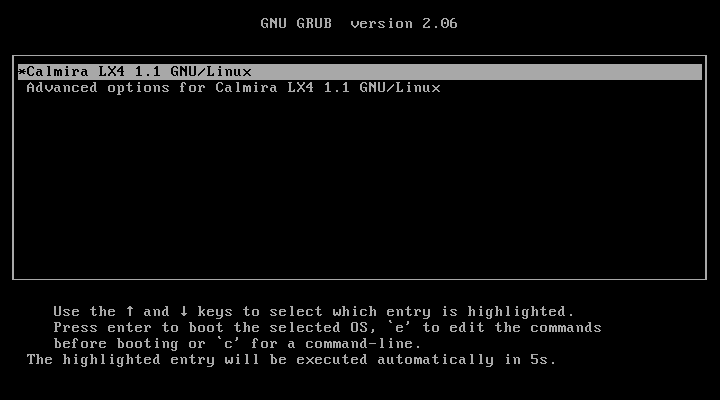
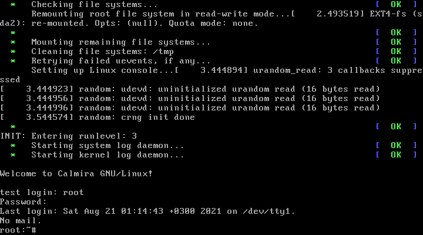

# Вход в систему

В предыдущей инструкции вы ввели команду `reboot` для перезагрузки. После того, как ваш ПК включится, вас будет приветствовать загрузочное меню GRUB:



Для загрузки Calmira выберите пункт `Calmira LX4 1.1 GNU/Linux`. Во время загрузки будут выведены сообщения ядра, а через какое-то время - сообщения загрузки сервисов SysVInit. Как только появится сообщение `Welcome to Calmira GNU/Linux!`, система будет загружена полностью. Она запросит у вас логин и пароль. Введите их, если во время настройки вы создавали пользователя, если нет, то зайдите из-под корневой учётной записи и продолжите дальнейшую настройку. Логин: `root`, пароль: `root`.

```
Welcome to Calmira GNU/Linux!

calm-pc login: 
Password: 
```

Если вы ввели логин, а пароль не вводите на протяжении 60 секунд, то у вас снова отобразится приветственное сообщение `Welcome to...` и запрос к вводу логина и пароля. Учитывайте, что вы не увидите никаких символов при вводе пароля. Это правило актуально так же для утилит `su` и `sudo`.

После удачного входа в систему отобразится дата последнего входа в Calmira, число пропущенных mail сообщений (в случае отсутствия отобразится `No mail.`), а так же системное приглашение к вводу команды (PS1): `root:~#`. Вместо root будет имя пользователя, под которым вы вошли в систему, `:` разделяет имя пользователя и директорию в которой он находится, соответственно, вместо `~` будет отображаться та директория, в которой находится пользователь. Знак `~` означает, что вы находитесь в своей домашней директории. Если вы вошли от имени root, то помимо соответствующего имени в начале приглашения (до двоеточия), в конце приглашения (после рабочей директории) будет отображён знак `#`. Он означает, что вы имеете повышенные привилегии. Если вы вошли от имени обычного пользователя, то вместо этого знака будет `$`.


