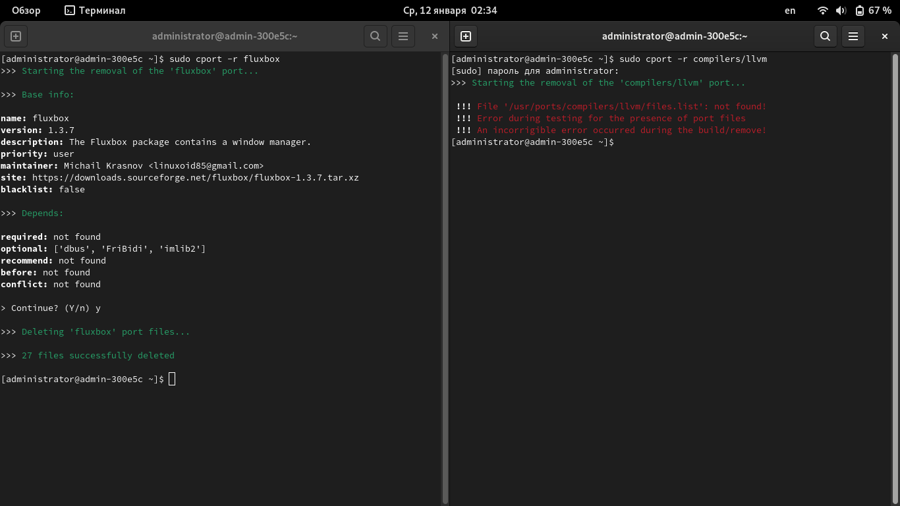

# Введение в порты

Порты - относительно молодой (в CalmiraLinux), но, в тоже время, очень удобный инструмент управления ПО. На данный момент, с помощью портов можно только устанавливать и удалять ПО, но в скором времени будут доступны новые функции.

## Введение

Система портов находится в `/usr/ports`. Всё программное обеспечение разделено на категории.

В каждой категории несколько подкаталогов с портом программы. Порт представляет из себя несколько файлов:

- `install` - файл с инструкциями по сборке порта;
- `port_configuration.sh` - дополнительные параметры порта (опционально);
- `files.list` - список файлов, которые устанавливает порт (опционально);
- `config.json` - информация о порте (имя, версия, описание, сборщик, пр.);
- `resources.conf` - информация для пакетного менеджера `cport` (ссылка для скачивания, архив для распаковки);

## Управление программным обеспечением из системы портов

Для управления программным обеспечением (установка, удаление, просмотр информации) используется пакетный менеджер `cport` (Calmira Ports). На данный момент он в состоянии альфа-тестирования, но уже неплохо подходит для управления ПО. Из его возможностей можно отметить:

- Сборку порта;
- Удаление порта;
- Просмотр о нём информации;
- Работа с чёрным списком системы портов.

Синтаксис:

```bash
cport [-h] [--install INSTALL [INSTALL ...]] [--remove REMOVE [REMOVE ...]]
      [-f FLAGS] [--info INFO] [--blacklist.add ADD_BLACKLIST]
      [--blacklist.remove REMOVE_BLACKLIST] [--blacklist.fetch FETCH_BLACKLIST] [-v]
```

### Опции

- `--install`, `-i` - установка порта;
- `--remove`, `-r` - удаление порта;
- `--info`, `-I` - просмотр информации о порте;
- `--blacklist.add` - добавить порт в чёрный список;
- `--blacklist.remove` - удалить порт из чёрного списка;
- `--blacklist.fetch` - проверить, добавлен ли указанный порт в чёрный список;
- `--version`, `-v` - версия;
- `--help`, `-h` - краткая справка.

### Установка программ из портов

Для того, чтобы установить порт, используется опция `--install`:

```bash
cport --install base/editors/vim
```

Данная команда установит Vim, который находится в категории `base/editors`.

```bash
cport -i general/llvm
```

```title="Вывод утилиты"
>>> Starting building a port 'compilers/llvm'...

>>> Base info:

name: llvm
version: 13.0.0
description: The LLVM package contains a collection of modular and reusable compiler and toolchain technologies. The Low Level Virtual Machine (LLVM) Core libraries provide a modern source and target-independent optimizer, along with code generation support for many popular CPUs (as well as some less common ones!). These libraries are built around a well specified code representation known as the LLVM intermediate representation ("LLVM IR").
priority: user
maintainer: Michail Linuxoid85 Krasnov <linuxoid85@gmail.com>
site: https://github.com/llvm/llvm-project
blacklist: false

>>> Depends:

required: ['compilers/cmake']
optional: not found
recommend: not found
before: not found
conflict: not found

> Continue? (Y/n) 
```

### Удаление порта

Для удаления порта используется ключ `--remove`.

!!! warning "Обратите внимание!"

    Удаление будет работать только в том случае, если в порте присутствует файл `files.list` (см. следующий пункт)!

    

    **Рис.1:** Сравните два окна. В левом удаляется установленный порт `fluxbox`, у которого есть файл `files.list`. В таком случае удаление возможно. В правом окне удаляется порт `compilers/llvm`, у которого данного файла нет, поэтому вызвана следующая ошибка:

    ```
     !!! File '/usr/ports/compilers/llvm/files.list': not found!
     !!! Error during testing for the presence of port files
     !!! An incorrigible error occurred during the build/remove!
    ```

```bash
cport --remove base/editors/vim
```

## Конфигурация порта

Все сведения и параметры порта находятся в файле `config.json`. Его примерное содержимое здесь:

```json title="config.json"
{
    "name": "имя порта *",
    "version": "версия порта *",
    "description": "описание порта *",
    "site": "ссылка на домашнюю страницу/репозиторий программы порта",
    "maintainer": "сопровождающий порт *",
    "priority": "приоритет порта *",
    "release": "релиз Calmira, для которого предназначен порт",
    "deps": {
        "required": [
            "необходимые зависимости"
        ],
        "runtime": [
            "необходимые зависимотси в рантайме"
        ],
        "optional": [
            "опциональные зависимости"
        ],
        "recommend": [
            "рекомендуемые зависимости"
        ],
        "before": [
            "порт должен быть установлен перед этими зависимостями"
        ],
        "conflict": [
            "конфликтующие с этим портом зависимости"
        ]
    },
    "bins": [
    	"список установленных программ (бинарных файлов) в /bin, /sbin, /usr{,/local}/bin, /usr{,/local}/sbin"
    ],
    "libs": [
    	"список установленных библиотек"
    ],
    "dirs": [
    	"список установленных директорий"
    ]
}
```

Все значения, указанные знаком `*` являются обязательными. Остальные вы используете по мере необходимости.

Подробное объяснение параметров в таблице ниже.

| Параметр | Объяснение | Приоритет |
|----------|------------|-----------|
| `name` | Имя пакета. Важно не путать имена пакета и порта. Например, имя пакета - `vim`, а имя порта - `/base/editors/vim` | Необходимый |
| `version` | Версия пакета | Необходимый |
| `description` | Описание пакета (для чего он предназначен). Только на английском или русском языках. | Необходимый |
| `site` | Домашняя страница/страница с опсианием программы/ссылка на репозиторий с исходным кодом программы | Опциональный |
| `maintainer` | Имя/псевдоним, а так же почта сопровождающего порта | Необходимый |
| `priority` | Приоритет порта - пользовательский или системный | Необходимый |
| `release` | Порт подготовлен только для определённого релиза дистрибутива CalmiraLinux, на других работа будет некорректной. Номер релиза системы берётся из параметра `DISTRIB_RELEASE` файла `/etc/lsb-release`. | Опциональный |
| `deps` | В этой секции описываются зависимости порта (см. пункт "Зависимости поля `deps`") | Опциональный |
| `bins` | Установленные программы в `/{bin,sbin}` и `/usr/{bin,sbin}` | Опциональный |
| `libs` | Установленные библиотеки | Опциональный |
| `dirs` | Установленные директории | Опциональный |

!!! note "Обратите внимание"
	Если у параметра установлен необходимый приоритет, то этот параметр **обязательно** должен присутствовать в `config.json`. Опциональные параметры выбираются, если сопровождающий считает нужным, а так же по мере наличия нужной информации для заполнения значений этих параметров.

### Зависимости поля `deps`

Примерное содержимое поля `deps`:

```json title="Фрагмент config.json: содержимое поля 'deps'"
"deps": {
    "required": [
        "необходимые зависимости"
    ],
    "runtime": [
        "необходимые зависимотси в рантайме"
    ],
    "optional": [
        "опциональные зависимости"
    ],
    "recommend": [
        "рекомендуемые зависимости"
    ],
    "before": [
       "порт должен быть установлен перед этими зависимостями"
    ],
    "conflict": [
        "конфликтующие с этим портом зависимости"
    ]
},
```

**Параметры:**

| Параметр | Объяснение |
|----------|------------|
| `required` | Необходимые зависимости, без которых порт не может быть собран и установлен. Перед сборкой данного порта, соберите его необходимые зависимости из этого параметра. |
| `runtime` | Необходимые зависимости во время работы компонентов пакета |
| `optional` | Опциональные зависимости. Не обязательны к сборке и установке. Обычно расширяют функционал искомого порта. |
| `recommend` | Рекомендуемые зависимости. Так же не обязательны к сборке и установке, но без них пакет порта может работать нестабильно/некорректно, либо не будут доступны определённые функции и возможности |
| `before` | Необязательные зависимости. Тоже самое, что `optional` и `recommend`, но разница в том, что опциональные и рекомендуемые зависимости могут быть установлены после сборки искомого порта, а `before` - либо установлены **до** искомого порта, либо не установлены вообще. |
| `conflict` | Эти порты конфликтуют с искомым. Возможно они/искомый порт затирают файлы друг друга, либо вызывают всевозможные несовместимости и регрессии. Настоятельно советуется удалить те порты, которые установлены в системе и перечислены в этой секции во избежание ошибок |