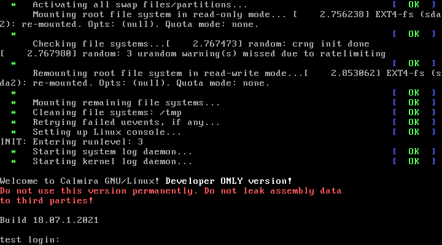

# Настройка окружения

## Редактирования текста приветствия



Перед тем, как система запросит ваш логин и пароль, она выведет приветственное сообщение приветствия. Если вам оно не нравится, либо вы хотите его заменить на нужное вам, отредактируйте файл `/etc/issue`:

```bash
# Очистка файла, если вам не надо, чтобы
# отображалось приветственное сообщение:
> /etc/issue

# Редактирование файла:
vim /etc/issue
```

## Редактирование общесистемных настроек окружения

Основной упор в Calmira GNU/Linux на работу в TTY, а не графике. Поэтому пользователям было бы неплохо отредактировать настройки по умолчанию для более комфортной работы. Общесистемные настройки окружения находятся в файле `/etc/profile`.

Функции `pathremove`, `pathprepend`, `pathappend` предназначены для работы с PATH. Функция `ver` отображает информацию о релизе дистрибутива Calmira, а system_welcome показывает информацию о базовых командах и предназначен для вставки в `/etc/bashrc`, `/etc/skel/.bashrc` и/или `~/.bashrc`.

По умолчанию в `PATH` содержатся директории `/bin`, `/sbin`, `/usr/bin`, `/usr/sbin`. Если вы создаёте обычного пользователя без привилегий, специфичных пользователю root, то в переменной `PATH` из его файла `~/.bashrc` **НЕ** должно быть директорий `/sbin` и `/usr/sbin`. Обычному пользователю программы оттуда не понадобятся, так же эта операция обезопасит вас и непривелигированного пользователя от всевозможных ошибок и вирусов. Для этого в `~/.bashrc` или `~/.profile` обычного (не root) пользователя добавьте строки:

```bash title="~/.bashrc или ~/.profile"
PATH=/bin:/usr/bin
```

Такая строка создаст *безопасный* `PATH`.

Если вы создали нового пользователя, то скопируйте все скрытые файлы из `/etc/skel/*`, если они не скопировались автоматически при создании этого пользователя. В конфигурационных файлах из `/etc/skel` уже произведены все настройки по умолчанию, в т.ч. настроен PATH для более безопасной и надёжной работы. Если вы скопировали из этой директории все скрытые файлы, то вам не надо самостоятельно изменять значение `PATH`, так как это сделано уже за вас.

!!! danger "Внимание!"
    Если вы, всё же, по каким-то причинам хотите иметь в `PATH` директории `/sbin` и `/usr/sbin`, то не проще-ли создать для этого *отдельного* пользователя с **повышенными** привилегиями? Этот вариант будет намного лучше, чем нахождение указанных директорий в `PATH` обычного непривилегированного пользователя.

***

По умолчанию системное приглашение к вводу безцветное и непривлекательное. Если вы хотите переделать его, то отредактируйте значение переменной `PS1`. Возможно использование escape-последовательностей для изменения цвета приглашения. Так же дополнительные последовательности, из которых строится приглашение к вводу в консоль:

<table>
  <tr>
    <th align="left">Последов.</th>
    <th align="left">Значение</th>
    <th align="left">Последов.</th>
    <th align="left">Значение</th>
  </tr>
  <tr>
    <td><tt>\a</tt></td>
    <td>Издать звуковой сигнал</td>
    <td><tt>\@</tt></td>
    <td>Текущее время в 12-часовом формате <em>AM/PM</em></td>
  </tr>
  <tr>
    <td><tt>\d</tt></td>
    <td>Текущая дата в формате <em>день_недели месяц число</em>: <tt>Mon May 16</tt></td>
    <td><tt>\A</tt></td>
    <td>Текущее время в 24-часовом формате <em>часы:минуты</em></td>
  </tr>
  <tr>
  	<td><tt>\h</tt></td>
  	<td>Имя локальной машины -- имя домена</td>
  	<td><tt>\r</tt></td>
  	<td>Имя пользователя</td>
  </tr>
  <tr>
  	<td><tt>\H</tt></td>
  	<td>Полное имя хоста</td>
  	<td><tt>\v</tt></td>
  	<td>Номер версии командной оболочки</td>
  </tr>
  <tr>
  	<td><tt>\j</tt></td>
  	<td>Число заданий, действующих в текущем терминале</td>
  	<td><tt>\V</tt></td>
  	<td>Номер версии и выпуска командной оболочки</td>
  </tr>
  <tr>
  	<td><tt>\l</tt></td>
  	<td>Имя текущего устр-ва терминала</td>
  	<td><tt>\w</tt></td>
  	<td>Имя текущего рабочего каталога</td>
  </tr>
  <tr>
  	<td><tt>\n</tt></td>
  	<td>Переход на новую строку</td>
  	<td><tt>\W</tt></td>
  	<td>Последняя часть имени текущего рабочего каталога</td>
  </tr>
  <tr>
  	<td><tt>\r</tt></td>
  	<td>Возврат каретки</td>
  	<td><tt>\!</tt></td>
  	<td>Имя текущей команды в истории</td>
  </tr>
  <tr>
  	<td><tt>\s</tt></td>
  	<td>Имя программы в программной оболочке</td>
  	<td><tt>\#</tt></td>
  	<td>Число команд, введённых в текущем сеансе</td>
  </tr>
  	<td><tt>\t</tt></td>
  	<td>Текущее время в 24-часовом формате</td>
  	<td><tt>\$</tt></td>
  	<td>Выводит <tt>$</tt>, если пользователь не является root, если это root, то выводит <tt>#</tt></td>
  </tr>
  <tr>
  	<td><tt>\T</tt></td>
  	<td>Текущее время в 12-часовом формате</td>
  	<td><tt>\[</tt> и <tt>\]</tt></td>
  	<td>Отмечает начало и конец (соотв.) последовательности непечатаемых символов</td>
  </tr>
</table>

## Редактирование настроек bash

Интерпретатором по умолчанию в Calmira является bash. Его настройки расположены в `/etc/bashrc`, `/etc/skel/.bashrc` и `~/.bashrc`. Рекомендуем вам редактировать файл `~/.bashrc`. Это изменит параметры только для пользователя, в домашней директории которого находится этот файл.

## Редактирование настроек Vim

В Calmira GNU/Linux по умолчанию используется редактор Vim. Его настройки расположены в файле `/etc/vimrc`. Строки:

```vimscript title="/etc/vimrc"
set nu
set lbr
```

Предназначены для переноса строк по словам и нумерации строк соотв.

## Редактирование настроек file system table

В файле `/etc/fstab` приведены базовые настройки монтирования файловых систем. Не изменяйте следующие строки, без которых система не сможет загрузиться корректно:

```bash title="/etc/fstab"
proc           /proc        proc     nosuid,noexec,nodev 0     0
sysfs          /sys         sysfs    nosuid,noexec,nodev 0     0
devpts         /dev/pts     devpts   gid=5,mode=620      0     0
tmpfs          /run         tmpfs    defaults            0     0
devtmpfs       /dev         devtmpfs mode=0755,nosuid    0     0
```

## Установка имени хоста

```bash
echo "calmira_pc" > /etc/hostname
```

Замените `calmira_pc` на нужное вам.